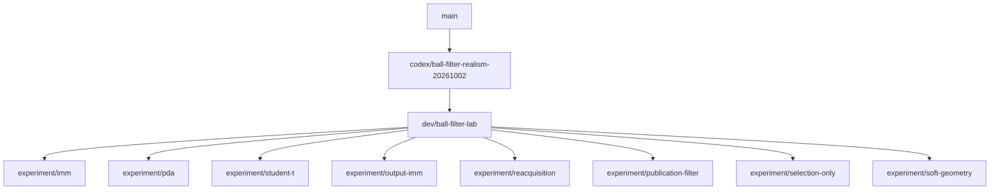

# Ball-filter development branches

`dev/ball-filter-lab` is the shared development environment: the consolidated
ball-filter baseline, Twix optimization panel, MCAP replay/scoring/tuning,
monitor, simulator, launcher scripts, and supporting robot nodes.

Each `experiment/<variant>` branch descends directly from the same lab commit.
Shared tooling belongs on the lab branch. Port only algorithm changes, parameters,
and focused tests to experiments. Update all experiments together when advancing
the lab base; use the same recordings, scoring implementation, evaluation settings,
and search budgets for comparisons. Archived performance results do not validate
these ports against the new baseline. Freeze candidates before fresh held-out runs.



## Next-game branch (PR #2944)

`codex/ball-filter-realism-20261002` contains the tuned, extended normal filter and its required
runtime changes, without the replay/tuning tools, simulator, Twix lab panel,
or experimental variants. It is the parent of the lab tooling commits. The
validated auxiliary publication correction is already part of this normal-filter
baseline; the archive experiments remain separate. Rebase this branch onto main
first, then replay the lab commits and experiments in order.

## Fresh checkout

### Preferred parameter candidate (2026-10-04)

`dev/ball-filter-preferred-simulator-20261004` combines the shared simulator and
Twix tooling with the selected normal-filter parameters. The filter implementation
is PR #2944 at `25c89eeac`, including the publication-output wiring and covariance
safeguard. No experimental filter extension is included. The production-only
branch is `dev/ball-filter-preferred-20261004`.

To inspect the exact candidate without further optimization, use a new output
directory and run these commands from the repository root in separate terminals:

```sh
git lfs pull
RUSTUP_TOOLCHAIN=1.98.1 ./simulator \
  --tune-ball-filter logs/preferred-filter-preview \
  --tuning-trials 0 --tuning-once --keep-tuning-open
```

```sh
RUSTUP_TOOLCHAIN=1.98.1 ./twix
```

In Twix, add **Ball-filter optimization**, click **Connect to simulator /
optimizer**, then **Open 3D view**. The simulator first captures six reference
recordings and verifies replay. Zero search trials preserve the selected
parameters; the live scenarios continue until Ctrl-C. Use a different output
directory for each fresh run. If Rust 1.98.1 is not installed, run
`rustup toolchain install 1.98.1`, or use the repository's Nix development shell.

This is the `diagnostic-pda-common-01` parameter candidate evaluated on the normal
filter, without PDA. Saved training/development losses were 2.238213891 and
1.825174834. The reserved final evaluation has not run, and development
recording-level regressions remain; this branch is for local evaluation.

Use the repository's `nix develop` environment, or Rust 1.98.1 and the native
build dependencies. Run `git lfs pull` for robot models and simulator assets.
From the repository root:

```sh
./simulator --help
./simulator
./twix
cargo run -p ball-filter-tuner --bin ball-filter-tuner -- --help
cargo run -p ball-filter-tuner --bin ball-filter-monitor -- --help
scripts/ball_filter_optimization --help
scripts/ball_filter_run_history --help
scripts/remote_ball_filter_tuning --help
```

See [the simulator guide](../../tools/simulate/README.md) for capture, replay,
viewer, ONNX Runtime, MuJoCo, and headless regression-test instructions. GUI
execution needs a graphics adapter and display; headless validation does not.

## Preservation

The `archive/ball-filter-*-20261004` tags and
`archive/pre-lab-*-20261004` tags preserve previous experiment histories
and worktree contents. They are not children of the new lab branch. Superseded branches and historical
worktrees were removed only after their complete Git trees were verified against
pushed archive tags. Recording/search artifacts remain under `logs/`.
The `archive/twix-monitor-compat-20261004` tag preserves separate unfinished CPU-effort
monitoring work; it is not needed for the lab's existing monitor.

The publication-filter experiment is the reference variant: its estimator was
already integrated into the shared baseline. Its branch documents that fact
rather than adding a second implementation.

## Active worktrees on the compiler

- `/home/schluis/hulk-game`: PR #2944, `codex/ball-filter-realism-20261002`.
- `/home/schluis/hulk`: `dev/ball-filter-lab`.
- `/home/schluis/hulk-experiment-<variant>`: corresponding `experiment/<variant>`.

Historical audit utilities (`check_remaining_worktrees.py` and
`tune_preserved_filters.py`) describe the archived pre-consolidation runs and
require their recorded datasets/binaries. To reconstruct an old source checkout,
use `git worktree add --detach <path> refs/tags/archive/pre-lab-<variant>-20261004`.
Use the shared lab and experiment branches for new comparisons.

### Previous velocity-aware scoring (v9)

Objective `single_ball_position_velocity_v9` scores the published velocity vector
in Field coordinates, in addition to position, availability and false tracks.
Reports and the Twix optimization panel show velocity RMSE in m/s, a separate
within-1m velocity RMSE, and reference/unavailable durations. Stationary balls
are included so spurious motion is penalized too. Truth velocity comes from
single-ball Field position differences over at most 100 ms; timestamp-matched
physical simulator truth takes precedence over pose-reconstructed labels.
Intervals with ambiguous truth, invalid timestamps or speeds above 15 m/s are
excluded. This derivative measures interval-average velocity, so kick/contact
frames can differ from an instantaneous endpoint velocity.

Velocity error is converted to displacement error over 300 ms, then receives
the same bounded squared-error loss and missing-output penalty as position.
The velocity term is separately time-normalized; its close-range subset has
weight 4, as with close-range position. Missing or invalid velocity contributes
the missing penalty, not a free omission. Raw velocity RMSE, velocity loss and
velocity-unavailable time may not worsen, either globally or per recording.
The horizon weights velocity accuracy; it does not evaluate a future physical
trajectory or assume a ball will move at constant velocity for 300 ms.

For historical v9 comparisons, re-evaluate every baseline under v9. Losses
from v8 and v9 are not directly comparable. For clean single-ball fast-shot
checks, also inspect the primary hypotheses: one sustained track is the target,
while clutter recordings may legitimately require alternative hypotheses.


### Literal ball-filter parameter limits

Limits now use their numeric values directly. Existing parameter files with the
old zero-disable convention must be explicitly converted before replay or tuning;
ordinary loading never interprets zero as infinity.

| Parameter | Meaning of zero | Permissive value |
| --- | --- | --- |
| `maximum_matching_distance`, `reacquisition_matching_distance` | Only coincident positions can match (where the gate applies) | 1000 m |
| `maximum_detection_distance`, `publication_maximum_distance` | Only the origin is within range | 1000 m |
| `maximum_detection_radius_ratio` | Reject positive radii; one requires equal radii | 1,000,000 |
| `radius_consistency_maximum_distance` | Check size only at the origin | 1000 m checks the whole field |
| `selection_confidence_cap` | Cap selection support at zero | 1,000,000 |
| `publication_maximum_covariance_ratio` | Require zero auxiliary covariance | 1,000,000 |
| Publication age and clear-view miss timeouts | Current observation only / expire on first clear miss | 1,000,000 s |
| `field_boundary_confidence_decay_distance` | Hard boundary | Large distance gives gradual decay |
| `publication_detection_noise` | Zero measurement noise, no implicit fallback | Set the desired noise explicitly |

Zero weights and decay rates already mean zero contribution and stay unchanged.
`resting_velocity_threshold` and the near-miss region use strict less-than tests:
zero gives an empty nonnegative speed/distance range. The likelihood-based resting
transition remains independent. A long near-miss timeout does not cancel its
independent decay rate; set that rate to zero for no additional decay.
The unused `maximum_matching_cost_validity_penalty_factor` has been removed.

Convert a **legacy standalone ball-filter file once**, writing a new file:

```sh
cargo run --release -p ball-filter-tuner --bin migrate-ball-filter-parameters --   legacy-ball-filter.json5 > literal-ball-filter.json5
```

Do not run this conversion on a file already using literal semantics: a deliberate
zero would be changed. Keep the original capture configuration and recording
immutable; use the converted capture configuration for live/replay verification.
Tuner reports record `parameter_semantics: "literal_limits_v1"`; the objective
version separately describes scoring. Search uses literal limits and logarithmic
coordinates (log1p for bounds including zero), without disabled-value sentinels.

### Local verification after the literal-limit conversion (2026-10-04)

The production change is committed locally as `bc15e987d`; its simulator equivalent
is `b2ccd7fe0`, followed by tooling/migration commit `1b8fbef53`. These commits have
not been pushed. Continue committing locally; do not push without a new instruction.

Validation: 116 ball-filter tests and 45 tuner tests pass; `simulate` and `twix`
check successfully. Explicitly converted capture parameters reproduce live outputs
on all 48 original recordings. Aggregate and per-recording scores exactly match
the preceding preferred baseline. Three additional fast-near-shot recordings also
pass live/replay verification.

A fresh search used 32 workers, 64 trials each, alternating coordinate search and
differential evolution, with one thread per worker and the existing 45 GiB RAM
cap. It included 26 training and 25 development recordings, adding the new fast
shots. All 2,048 trials completed; none improved training while satisfying the
position, velocity, availability and false-track guards. Training loss remains
3.972739359 and development loss 3.302223250 under v9. This is a bounded search,
not proof that no better parameters exist. No candidate was promoted.

Occlusion replay confirms a fragmentation example in
`final-contested/train-42.mcap` at 12.082 s: four pre-existing hypotheses remain;
the minimum squared Mahalanobis cost to the single returning detection is 0.449952,
above `maximum_matching_cost = 0.25`, so a fifth hypothesis starts at zero velocity.
An older hypothesis had survived robot occlusion but predicted only 0.0156 m/s.
It already estimated 0.0296 m/s at its last observation (11.442 s), when the
recorded physical ball speed was approximately 3.66 m/s. Occlusion exposes the
poor prediction; survival alone does not provide good reassociation. The physical
1000 m gate is not the limiting gate in this example. Fast-ball fragmentation also
occurs without obstacles, so these results do not identify occlusion as its sole
cause or establish a fix.

Local evidence and reproducible commands are under
`/home/schluis/hulk/logs/ball-filter-literal-parameters-20261004/`:
`parity-comparison.json`, `search/protocol.json`, `search/status.json`, and
`occlusion/summary.json`. Diagnostic source/binaries are preserved there without
adding instrumentation to the production filter. All jobs are finished.


### Current close-range kicking objective (2026-10-05)

At the user's request, `close_ball_position_velocity_v10` optimizes only ball truth
within 1 metre of the robot. It sums the independently normalized bounded position
loss and the bounded velocity-vector loss over a 300 ms horizon. Missing estimates
retain the same penalty in each close term. The only hard acceptance guards are
aggregate training close-range position RMSE and close-range velocity RMSE; both
must stay at or below the fixed preferred baseline. Per-recording guards and all
other metric guards are removed. Individual recordings, far-ball accuracy, lag,
false tracks and availability remain visible diagnostics. Development recordings
remain evaluation-only. Numeric parameter semantics stay `literal_limits_v1`.

The scoring and guard change applies to the tuner and simulator companion branch;
the production filter implementation is unchanged during this search. Commits stay
local and must not be pushed without another user instruction. Compare v10 runs
only with baselines re-evaluated under v10.

## Image observer and no-search demo (2026-10-05)

`./simulator demo` now runs all nine checked-in examples once, including the
fast-near-shot regression, with the current parameters. It launches the 3D view
and serves timestamped diagnostic images at `http://127.0.0.1:8765`. Use
`--headless` on a server. Twix has a **Run all scenarios · no search** button.
See [the simulator guide](../../tools/simulate/README.md#scenario-demo-and-image-observer)
for replay, HTTP endpoints, parameter overrides and shutdown options.

The first full lower-noise demo completed all nine 40-second recordings with
zero search trials. Evidence on the lab server is under
`/home/schluis/hulk/logs/ball-filter-image-interface-20261005/`.
The capture uses the close-range candidate from `a54a3e159`, with the example
noise reduction from `08d5646c7`. Images are schematic projections of recorded
state, not RGB camera images. The observer verifies original live/replay parity
before rendering alternative parameters.

The images expose issues not resolved by the aggregate tuning result:

- In the fresh fast-near-shot recording at elapsed **3.014 s**, the ball is
  **0.208 m** away and moves at **6.026 m/s**, while the selected model remains
  resting with zero velocity. Position error is only **0.084 m**. Newborn models
  start at zero velocity; the positive resting-speed threshold can convert them
  to resting before they learn motion. Reactivation requires three consistent,
  statistically significant observations. This also delays response to kicks
  of an already resting ball. Some shots leave camera coverage before that
  evidence accumulates.
- At **10.190 s**, a recently updated moving hypothesis estimates **5.77 m/s**,
  but the published result switches to a resting hypothesis last seen **7.188 s**
  earlier. With `selection_confidence_cap: 0`, every eligible ranking score is
  zero, so selection is sensitive to iteration order. Replaying the identical
  recording with only the cap raised to `1e6` retains the moving hypothesis at
  this instant. This is not a complete fix: it also switches later, as the field
  prior changes the ranking of a ball travelling beyond the sideline.
- The fresh fast-near-shot recording reaches **14 concurrent hypotheses**.
  These include long-lived distractors; this count alone does not prove that
  every hypothesis was spawned from the true ball. Reduced image noise did not
  remove the accumulation.
- In **contested**, a recorded opponent kick at physical episode time
  **12.494 s** is explicitly marked occluded and in the camera view. At observer
  elapsed **12.510 s**, truth speed is **6.13 m/s**, there is no ball detection,
  and the selected resting hypothesis is **8.43 s** old. A detection returns at
  **12.536 s**, with a new eighth hypothesis; selection only reaches a recent
  hypothesis by **12.668 s**, and its velocity is still zero. Occlusion and
  subsequent confirmation/velocity recovery are distinct parts of the failure.

Two one-parameter replay diagnostics (resting threshold zero and confidence cap
`1e6`) are saved with the evidence. They are **not adopted tuning results**;
there was no search or held-out validation of these alternatives. The examples
above are individual failures, not a replacement benchmark comparison. The
next work should address ranking ties, motion initialization/recovery and stale
hypothesis retention within the existing filter before calling the tuning done.
