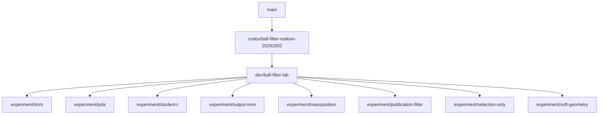

# Ball-filter development branches

`dev/ball-filter-lab` is the shared development environment: the consolidated
ball-filter baseline, Twix optimization panel, MCAP replay/scoring/tuning,
monitor, simulator, launcher scripts, and supporting robot nodes.

Each `experiment/<variant>` branch descends directly from the same lab commit.
Shared tooling belongs on the lab branch. Port only algorithm changes, parameters,
and focused tests to experiments. Update all experiments together when advancing
the lab base; use the same recordings, scoring implementation, evaluation settings,
and search budgets for comparisons. Archived performance results do not validate
these ports against the new baseline. Freeze candidates before fresh held-out runs.



## Next-game branch (PR #2944)

`codex/ball-filter-realism-20261002` contains the tuned, extended normal filter and its required
runtime changes, without the replay/tuning tools, simulator, Twix lab panel,
or experimental variants. It is the parent of the lab tooling commits. The
validated auxiliary publication correction is already part of this normal-filter
baseline; the archive experiments remain separate. Rebase this branch onto main
first, then replay the lab commits and experiments in order.

## Fresh checkout

### Preferred parameter candidate (2026-10-04)

`dev/ball-filter-preferred-simulator-20261004` combines the shared simulator and
Twix tooling with the selected normal-filter parameters. The filter implementation
is PR #2944 at `25c89eeac`, including the publication-output wiring and covariance
safeguard. No experimental filter extension is included. The production-only
branch is `dev/ball-filter-preferred-20261004`.

To inspect the exact candidate without further optimization, use a new output
directory and run these commands from the repository root in separate terminals:

```sh
git lfs pull
RUSTUP_TOOLCHAIN=1.98.1 ./simulator \
  --tune-ball-filter logs/preferred-filter-preview \
  --tuning-trials 0 --tuning-once --keep-tuning-open
```

```sh
RUSTUP_TOOLCHAIN=1.98.1 ./twix
```

In Twix, add **Ball-filter optimization**, click **Connect to simulator /
optimizer**, then **Open 3D view**. The simulator first captures six reference
recordings and verifies replay. Zero search trials preserve the selected
parameters; the live scenarios continue until Ctrl-C. Use a different output
directory for each fresh run. If Rust 1.98.1 is not installed, run
`rustup toolchain install 1.98.1`, or use the repository's Nix development shell.

This is the `diagnostic-pda-common-01` parameter candidate evaluated on the normal
filter, without PDA. Saved training/development losses were 2.238213891 and
1.825174834. The reserved final evaluation has not run, and development
recording-level regressions remain; this branch is for local evaluation.

Use the repository's `nix develop` environment, or Rust 1.98.1 and the native
build dependencies. Run `git lfs pull` for robot models and simulator assets.
From the repository root:

```sh
./simulator --help
./simulator
./twix
cargo run -p ball-filter-tuner --bin ball-filter-tuner -- --help
cargo run -p ball-filter-tuner --bin ball-filter-monitor -- --help
scripts/ball_filter_optimization --help
scripts/ball_filter_run_history --help
scripts/remote_ball_filter_tuning --help
```

See [the simulator guide](../../tools/simulate/README.md) for capture, replay,
viewer, ONNX Runtime, MuJoCo, and headless regression-test instructions. GUI
execution needs a graphics adapter and display; headless validation does not.

## Preservation

The `archive/ball-filter-*-20261004` tags and
`archive/pre-lab-*-20261004` tags preserve previous experiment histories
and worktree contents. They are not children of the new lab branch. Superseded branches and historical
worktrees were removed only after their complete Git trees were verified against
pushed archive tags. Recording/search artifacts remain under `logs/`.
The `archive/twix-monitor-compat-20261004` tag preserves separate unfinished CPU-effort
monitoring work; it is not needed for the lab's existing monitor.

The publication-filter experiment is the reference variant: its estimator was
already integrated into the shared baseline. Its branch documents that fact
rather than adding a second implementation.

## Active worktrees on the compiler

- `/home/schluis/hulk-game`: PR #2944, `codex/ball-filter-realism-20261002`.
- `/home/schluis/hulk`: `dev/ball-filter-lab`.
- `/home/schluis/hulk-experiment-<variant>`: corresponding `experiment/<variant>`.

Historical audit utilities (`check_remaining_worktrees.py` and
`tune_preserved_filters.py`) describe the archived pre-consolidation runs and
require their recorded datasets/binaries. To reconstruct an old source checkout,
use `git worktree add --detach <path> refs/tags/archive/pre-lab-<variant>-20261004`.
Use the shared lab and experiment branches for new comparisons.

### Velocity-aware scoring

Objective `single_ball_position_velocity_v9` scores the published velocity vector
in Field coordinates, in addition to position, availability and false tracks.
Reports and the Twix optimization panel show velocity RMSE in m/s, a separate
within-1m velocity RMSE, and reference/unavailable durations. Stationary balls
are included so spurious motion is penalized too. Truth velocity comes from
single-ball Field position differences over at most 100 ms; timestamp-matched
physical simulator truth takes precedence over pose-reconstructed labels.
Intervals with ambiguous truth, invalid timestamps or speeds above 15 m/s are
excluded. This derivative measures interval-average velocity, so kick/contact
frames can differ from an instantaneous endpoint velocity.

Velocity error is converted to displacement error over 300 ms, then receives
the same bounded squared-error loss and missing-output penalty as position.
The velocity term is separately time-normalized; its close-range subset has
weight 4, as with close-range position. Missing or invalid velocity contributes
the missing penalty, not a free omission. Raw velocity RMSE, velocity loss and
velocity-unavailable time may not worsen, either globally or per recording.
The horizon weights velocity accuracy; it does not evaluate a future physical
trajectory or assume a ball will move at constant velocity for 300 ms.

Re-evaluate every baseline under v9 before comparing new candidates. Losses
from v8 and v9 are not directly comparable. For clean single-ball fast-shot
checks, also inspect the primary hypotheses: one sustained track is the target,
while clutter recordings may legitimately require alternative hypotheses.
