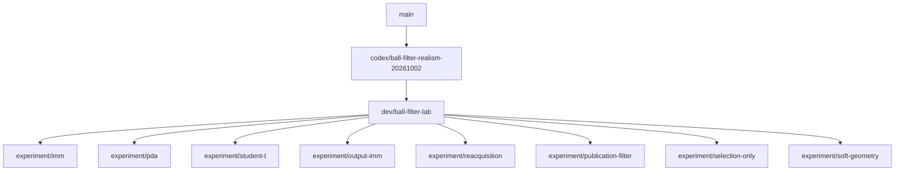

# Ball-filter development branches

`dev/ball-filter-lab` is the shared development environment: the consolidated
ball-filter baseline, Twix optimization panel, MCAP replay/scoring/tuning,
monitor, simulator, launcher scripts, and supporting robot nodes.

Each `experiment/<variant>` branch descends directly from the same lab commit.
Shared tooling belongs on the lab branch. Port only algorithm changes, parameters,
and focused tests to experiments. Update all experiments together when advancing
the lab base; use the same recordings, scoring implementation, evaluation settings,
and search budgets for comparisons. Archived performance results do not validate
these ports against the new baseline. Freeze candidates before fresh held-out runs.



## Next-game branch (PR #2944)

`codex/ball-filter-realism-20261002` contains the tuned, extended normal filter and its required
runtime changes, without the replay/tuning tools, simulator, Twix lab panel,
or experimental variants. It is the parent of the lab tooling commits. The
validated auxiliary publication correction is already part of this normal-filter
baseline; the archive experiments remain separate. Rebase this branch onto main
first, then replay the lab commits and experiments in order.

## Fresh checkout

Use the repository's `nix develop` environment, or Rust 1.98.1 and the native
build dependencies. Run `git lfs pull` for robot models and simulator assets.
From the repository root:

```sh
./simulator --help
./simulator
./twix
cargo run -p ball-filter-tuner --bin ball-filter-tuner -- --help
cargo run -p ball-filter-tuner --bin ball-filter-monitor -- --help
scripts/ball_filter_optimization --help
scripts/ball_filter_run_history --help
scripts/remote_ball_filter_tuning --help
```

See [the simulator guide](../../tools/simulate/README.md) for capture, replay,
viewer, ONNX Runtime, MuJoCo, and headless regression-test instructions. GUI
execution needs a graphics adapter and display; headless validation does not.

## Preservation

The `archive/ball-filter-*-20261004` branches and
`archive/pre-lab-*-20261004` checkpoints preserve previous experiment histories
and worktree contents. They are not children of the new lab branch. Original
worktrees and ignored recording/search artifacts are retained during migration.
`archive/twix-monitor-compat-20261004` preserves separate unfinished CPU-effort
monitoring work; it is not needed for the lab's existing monitor.

The publication-filter experiment is the reference variant: its estimator was
already integrated into the shared baseline. Its branch documents that fact
rather than adding a second implementation.
